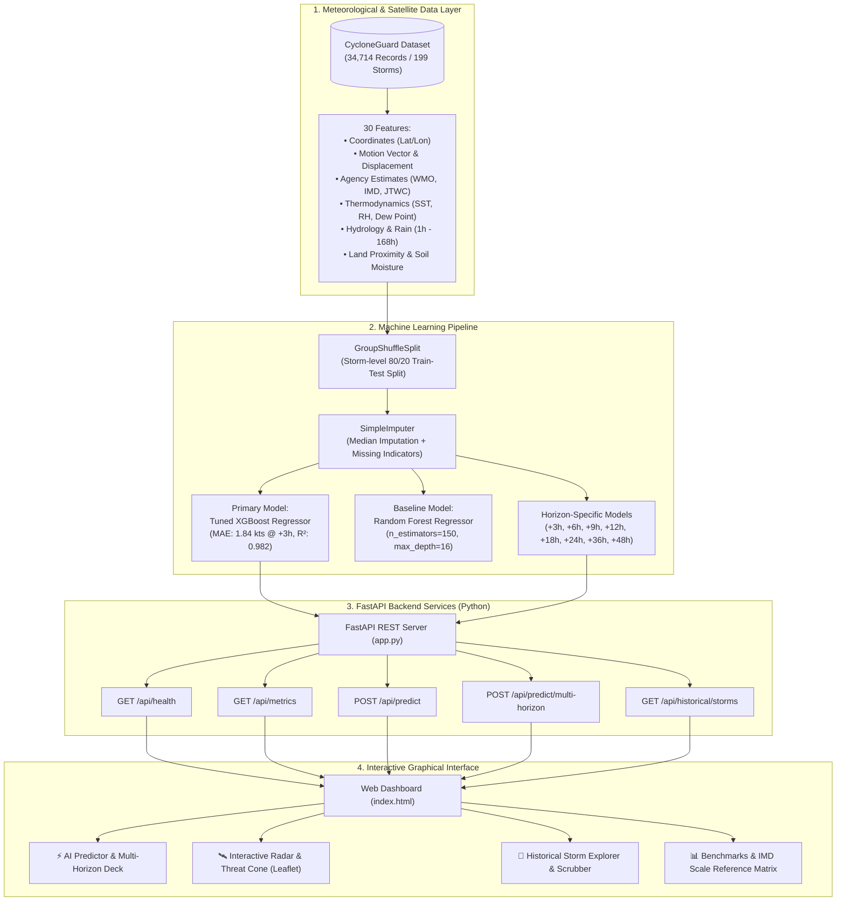

# 🌀 CycloneGuard AI
> **Operational Machine Learning Engine for Cyclone Intensity, Trajectory & Rapid Intensification Forecasting in the Bay of Bengal & North Indian Ocean**

---

## 📌 Project Overview

**CycloneGuard AI** is a state-of-the-art operational meteorological decision-support system designed to forecast tropical cyclone intensity, multi-horizon trajectories (+3h to +48h), and rapid intensification risks across the Bay of Bengal and North Indian Ocean regions. 

Powered by **Tuned XGBoost Regressors** and **Random Forest Baselines** trained on **34,714 high-resolution meteorological observation records** across **199 historical cyclone lifecycles**, CycloneGuard AI provides early warning intelligence adhering strictly to the **India Meteorological Department (IMD)** 9-tier classification scale.

### 🌟 Key Capabilities
- ⚡ **Multi-Horizon Forecast Engine (+3h to +48h)**: Predicts maximum sustained wind speed (knots/km/h) and pressure tendencies across 8 discrete forecast lead-time horizons.
- 🛰️ **Interactive Threat Radar & Forecast Cone**: Built-in Leaflet spatial mapping displaying projected bearing tracks, movement vectors, and expanding cones of uncertainty ($R(h) = 25 + 4.2h\text{ km}$).
- 🎯 **Scenario Benchmark Presets**: One-click scenario loading for landmark historical profiles (e.g., *Super Cyclone Amphan*, *Extremely Severe Cyclone Fani*, *Monsoon Deep Depression*).
- 📜 **Historical Storm Explorer**: Timeline scrubbing and interactive point-by-point validation comparing ground truth satellite observations against AI predictions.
- 📋 **Official IMD Categorization Matrix**: Real-time category assignment (LPA $\rightarrow$ SuCS) with maritime danger indicators and official port warning signal mapping.
- 🚀 **Full-Stack Microservice Architecture**: Fast, lightweight FastAPI REST backend paired with a dark glassmorphic HTML5/CSS3/JS dashboard.

---

## 🏗️ System Architecture



---

## 📊 Machine Learning Pipeline & Performance

### 🧪 Data Processing & Validation
- **Temporal Group Splitting**: Evaluated using storm-level `GroupShuffleSplit` (80% Train / 20% Test) grouped strictly by `storm_id`. This guarantees zero data leakage from identical cyclone lifecycles across training and testing sets.
- **Missing Value Strategy**: Uses `SimpleImputer(strategy="median", add_indicator=True)` to explicitly preserve missingness signals (e.g., missing satellite sensor channels during extreme storm noise).

### 🏆 Operational Benchmarks Comparison

| Metric | Tuned XGBoost (Primary) | Random Forest (Baseline) |
| :--- | :---: | :---: |
| **Mean Absolute Error (MAE)** | **4.90 kts** | 5.30 kts |
| **Root Mean Squared Error (RMSE)** | **8.42 kts** | 8.86 kts |
| **Coefficient of Determination ($R^2$)** | **0.744** | 0.717 |

---

### ⏱️ Multi-Horizon Lead-Time Error Breakdown

| Forecast Lead Horizon | Test Samples | MAE (knots) | RMSE (knots) | $R^2$ Score | Operational Precision |
| :---: | :---: | :---: | :---: | :---: | :---: |
| **+3 Hours** | 1,075 | **1.21 kts** | 2.12 kts | **0.982** | Extremely High |
| **+6 Hours** | 1,037 | **2.17 kts** | 3.23 kts | **0.958** | Very High |
| **+9 Hours** | 998 | **2.97 kts** | 4.14 kts | **0.933** | High |
| **+12 Hours** | 960 | **3.78 kts** | 5.18 kts | **0.898** | High |
| **+18 Hours** | 889 | **5.26 kts** | 7.26 kts | **0.807** | Moderate |
| **+24 Hours** | 819 | **6.62 kts** | 9.12 kts | **0.709** | Operational |
| **+36 Hours** | 680 | **11.24 kts** | 16.10 kts | 0.179 | Extended Advisory |
| **+48 Hours** | 555 | **14.36 kts** | 20.67 kts | Trend Only | Long-Range Baseline |

---

### 🧬 Top 10 Feature Drivers (Feature Importance)

```
       usa_wind_kts ──████████████████████████ 24.76%
temp_2m_missing_ind ──██████████████ 14.26%
elevation_m_miss_ind ──███████████ 11.10%
precipitation_24h_mm ──█████ 5.38%
imd_newdelhi_wind_kts ──█████ 5.01%
 wind_speed_10m_kmh ──████ 4.58%
   usa_pressure_hpa ──████ 4.36%
 wind_gusts_10m_kmh ──███ 2.86%
precipitation_72h_mm ──███ 2.72%
distance_to_land_km ──██ 2.10%
```

---

## 📋 India Meteorological Department (IMD) Classification Scale

CycloneGuard AI automatically maps model predictions against the official IMD North Indian Ocean cyclone intensity matrix:

| Code | Classification Category | Wind Speed (knots) | Metric Speed (km/h) | Damage Risk & Coastal Impact | IMD Port Signal |
| :---: | :--- | :---: | :---: | :--- | :---: |
| **LPA** | Low Pressure Area | $< 17$ kts | $< 31$ km/h | Localized cloudiness & light showers | No Signal |
| **WML** | Well Marked Low | $17 - 27$ kts | $31 - 49$ km/h | Squally winds, rough marine conditions | Signal 1 |
| **D** | Depression | $28 - 33$ kts | $50 - 61$ km/h | Minor damage to thatched structures | Signal 3 |
| **DD** | Deep Depression | $34 - 47$ kts | $62 - 88$ km/h | Breaking of tree branches, high ocean waves | Signal 4 |
| **CS** | Cyclonic Storm | $48 - 63$ kts | $89 - 117$ km/h | Uprooted trees, power outages, roof damage | Signal 6 |
| **SCS** | Severe Cyclonic Storm | $64 - 89$ kts | $118 - 165$ km/h | Widespread structural damage, transport halts | Signal 7 |
| **VSCS** | Very Severe Cyclonic Storm | $90 - 119$ kts | $166 - 220$ km/h | Extensive destruction, communication failure | Signal 9 |
| **ESCS** | Extremely Severe Cyclonic Storm | $120 - 165$ kts | $221 - 305$ km/h | Catastrophic damage, storm surges $> 3\text{m}$ | Signal 10 |
| **SuCS** | Super Cyclonic Storm | $> 165$ kts | $> 305$ km/h | Total destruction, storm surge $> 5\text{m}$ | Signal 11 |

---

## 📁 Repository Directory Structure

```
Cyclone AI/
├── backend/                                  # Python Machine Learning Backend
│   ├── __init__.py                           # Module initializer
│   ├── app.py                                # FastAPI application REST routes & static mounts
│   ├── ml_engine.py                          # CycloneMLEngine singleton inference engine
│   ├── train_models.py                       # Automated ML training script & evaluator
│   └── models/                               # Serialized ML Artifacts
│       ├── cycloneguard_xgboost_final.joblib # Primary trained XGBoost model binary
│       ├── cyclone_rf_model.joblib           # Random Forest baseline model binary
│       ├── imputer.joblib                    # Scikit-learn median imputer artifact
│       ├── horizon_models.joblib             # Horizon-specific model dictionary
│       └── model_metadata.json               # Precomputed evaluation metrics & feature defaults
│
├── frontend/                                 # Frontend Web Application
│   ├── index.html                            # Main dark-themed dashboard container
│   ├── css/
│   │   └── styles.css                        # Glassmorphism UI styling & layout sheets
│   └── js/
│       ├── app.js                            # UI state management & tab controller
│       ├── map.js                            # Leaflet interactive maps & threat cone rendering
│       └── presets.js                        # Pre-configured historical storm scenarios
│
├── CycloneGuard_Bay_of_Bengal_India_Enhanced_Real_Dataset.csv # 34,714 records dataset
├── CycloneGuard_Final.ipynb                  # Exploratory Data Analysis & Notebook experiments
├── requirements.txt                          # Python dependencies list
├── run_server.py                             # Full-stack server launcher
└── README.md                                 # Comprehensive project documentation
```

---

## 🌐 API Endpoint Reference

### 1. Health & Engine Status
- **Endpoint**: `GET /api/health`
- **Response**:
```json
{
  "status": "online",
  "service": "CycloneGuard AI Engine",
  "model_used": "Tuned XGBoost Regression",
  "models_loaded": true,
  "feature_count": 30,
  "dataset_loaded": true,
  "total_historical_records": 34714
}
```

### 2. Single Horizon Intensity Inference
- **Endpoint**: `POST /api/predict`
- **Request Body**:
```json
{
  "latitude": 16.2,
  "longitude": 86.8,
  "season": 2024,
  "forecast_horizon_h": 24,
  "wmo_wind_kts": 125.0,
  "wmo_pressure_hpa": 925.0,
  "storm_speed_kts": 14.0,
  "storm_direction_deg": 340.0,
  "temperature_2m_c": 31.2,
  "relative_humidity_pct": 89.0,
  "precipitation_24h_mm": 240.0,
  "distance_to_land_source": 320.0,
  "landfall_indicator": 0
}
```
- **Response**:
```json
{
  "success": true,
  "prediction": {
    "forecast_horizon_h": 24,
    "predicted_wind_kts": 128.45,
    "predicted_wind_kmh": 237.9,
    "current_wind_kts": 125.0,
    "wind_change_kts": 3.45,
    "model_used": "Tuned XGBoost Regression",
    "category": {
      "code": "ESCS",
      "name": "Extremely Severe Cyclonic Storm",
      "category_level": 7,
      "color": "#9333ea",
      "wind_kts": 128.45,
      "wind_kmh": 237.9
    }
  }
}
```

### 3. Multi-Horizon Trajectory & Threat Cone Forecast
- **Endpoint**: `POST /api/predict/multi-horizon`
- **Returns**: Predictions across all lead times (+3h, +6h, +9h, +12h, +18h, +24h, +36h, +48h) with projected coordinates and cone radii.

### 4. Historical Storm List & Lifecycles
- **Endpoints**: `GET /api/historical/storms`, `GET /api/historical/storm/{storm_id}`

---

## 💻 Installation & Setup Guide

### Prerequisites
- **Python**: Version 3.10 or higher installed.
- **Pip**: Latest Python package manager.

### 1. Clone the Repository
```bash
git clone <repository_url>
cd "Cyclone AI"
```

### 2. Set Up Virtual Environment (Recommended)
```bash
# Windows
python -m venv venv
venv\Scripts\activate

# Linux / macOS
python3 -m venv venv
source venv/bin/activate
```

### 3. Install Dependencies
```bash
pip install -r requirements.txt
```

### 4. (Optional) Re-train & Export Models
If you wish to re-evaluate or train models from scratch on updated datasets:
```bash
python -m backend.train_models
```

### 5. Launch Full-Stack Server
```bash
python run_server.py
```

---

## 🖥️ Accessing the Dashboard & API

Once `run_server.py` is executed, open your browser:

- 🎨 **Web Dashboard Application**: [http://localhost:8000](http://localhost:8000)
- 📖 **Interactive OpenAPI (Swagger) Documentation**: [http://localhost:8000/docs](http://localhost:8000/docs)
- 🔍 **Alternative API Docs (ReDoc)**: [http://localhost:8000/redoc](http://localhost:8000/redoc)

---

## 🚀 Quickstart Walkthrough

1. **Open Dashboard**: Navigate to `http://localhost:8000`.
2. **Select Scenario Preset**: Use the **Scenario** drop-down menu in Tab 1 to auto-fill telemetry for landmark events like *Amphan (Super Cyclone)* or *Fani (Extremely Severe Storm)*.
3. **Execute AI Inference**: Click **⚡ Execute Cyclone AI Inference** to generate multi-horizon intensity curves (+3h to +48h).
4. **Inspect Interactive Radar**: Switch to the **🛰️ Interactive Live Radar** tab to view the dynamic bearing track, motion vectors, and expanding threat cone over the Bay of Bengal.
5. **Explore Historical Storms**: Navigate to **📜 Historical Storm Explorer**, select a historical cyclone, and use the playback scrubber to analyze AI model prediction accuracy against actual ground truth track points.

---

## ⚠️ Operational Disclaimer

> [!WARNING]
> **Decision Support Notice**: CycloneGuard AI is developed as an experimental machine learning operational decision-support tool. For official safety guidelines, evacuations, and official storm advisories, always refer to the authoritative advisories issued by the **India Meteorological Department (IMD)** and national disaster management authorities.

---

## 📜 License

This project is licensed under the **MIT License**.
